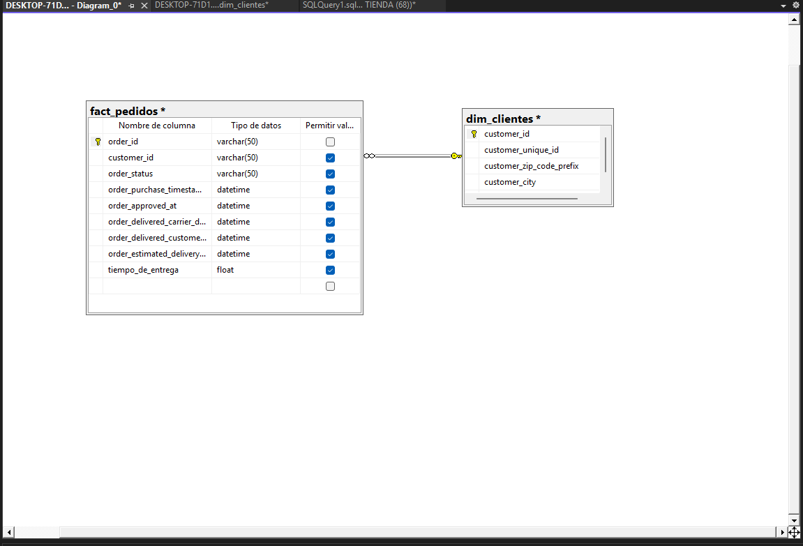
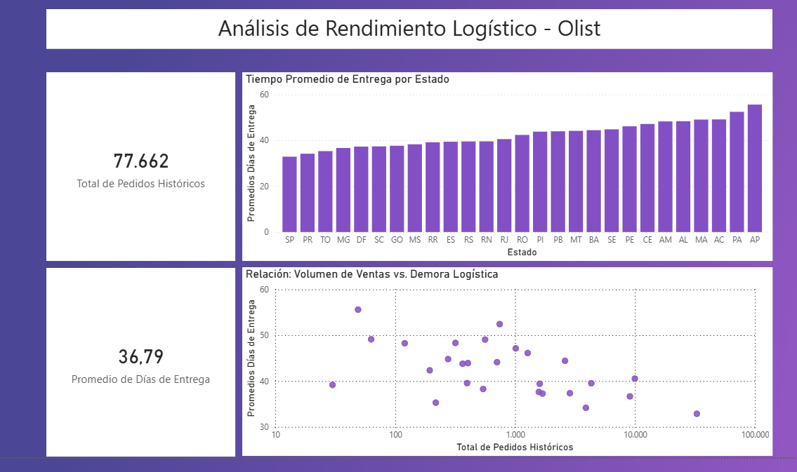

# 📦 Optimización Logística de E-Commerce (Olist) - End-to-End Data Pipeline

## 🎯 Objetivo del Proyecto
Este proyecto analiza el rendimiento logístico histórico del e-commerce brasileño Olist. El objetivo es identificar cuellos de botella geográficos en los tiempos de entrega mediante la construcción de un pipeline de datos completo (ETL), modelado dimensional y visualización analítica.

## 🛠️ Stack Tecnológico
* **Lenguaje:** Python (Pandas, SQLAlchemy, PyODBC).
* **Base de Datos:** SQL Server (Transact-SQL).
* **Business Intelligence:** Power BI (DAX, Data Modeling).
* **Entorno:** Visual Studio Code, Jupyter Notebooks, SSMS.

## ⚙️ Arquitectura de Datos (Pipeline)

### 1. Extracción y Transformación (ETL en Python)
* Ingesta de datasets masivos en formato CSV.
* Limpieza de datos: tratamiento de valores nulos y conversión de tipos de datos a formatos estrictos (`str`, `datetime`) para optimizar el uso de memoria.
* Filtro de anomalías lógicas (ej. tiempos de entrega con valores negativos).

### 2. Modelado Relacional (SQL Server)
* Inyección de DataFrames limpios directamente al motor relacional vía conexión ODBC.
* Definición de arquitectura de datos (DDL): asignación de tipos de datos eficientes (ej. `VARCHAR(50)` en lugar de `VARCHAR(MAX)`).
* Construcción de un **Modelo Estrella (Star Schema)** estableciendo Integridad Referencial entre Hechos y Dimensiones (Primary Keys y Foreign Keys).

### 3. Explotación Analítica (Power BI)
* Conexión en modo *Import* para aprovechamiento del motor VertiPaq.
* Creación de medidas dinámicas utilizando **DAX** (`COUNTROWS`, `AVERAGE`).
* Aplicación de transformaciones visuales avanzadas (Escala Logarítmica) para el tratamiento de valores atípicos (Outliers) en gráficos de dispersión.

## 📊 Insights y Descubrimientos Clave

1. **Correlación Geográfica-Logística:** Se detectó una correlación negativa clara. Los estados con mayor volumen de transacciones (como São Paulo) presentan los tiempos de entrega más eficientes (aprox. 32 días) debido a la centralización de la infraestructura logística.
2. **El Cuello de Botella del Norte:** El estado de Amapá (AP) representa una falla crítica en la cadena de suministro, con tiempos de espera superiores a los 55 días para un volumen marginal de pedidos, sugiriendo la necesidad de repensar las rutas tercerizadas hacia esa región.

